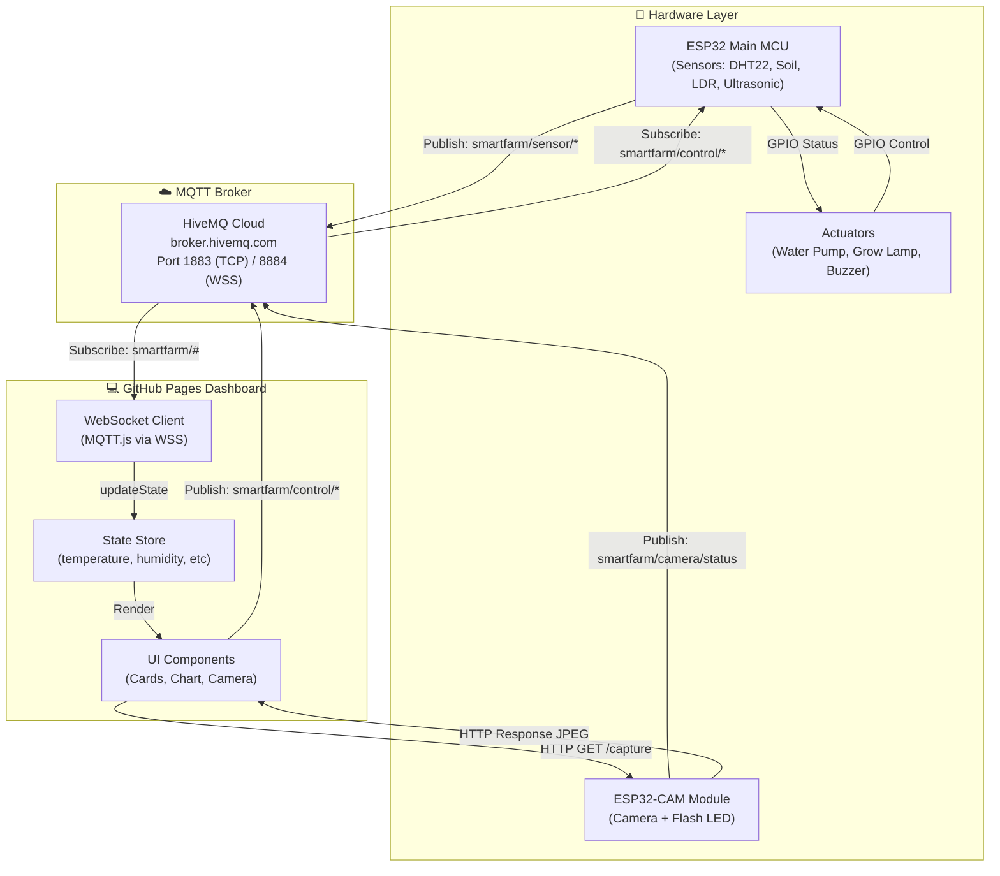
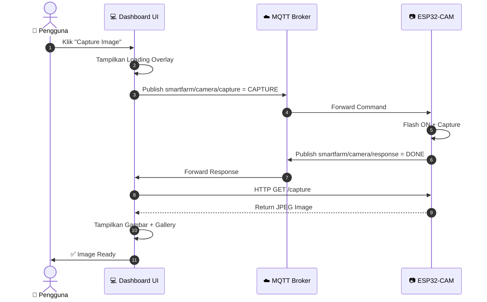
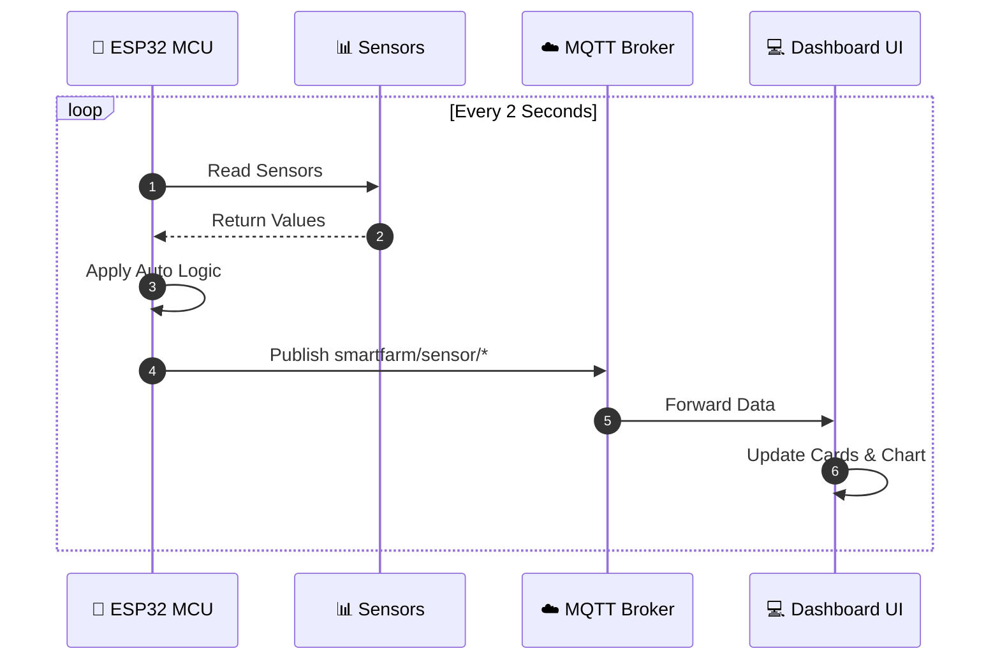
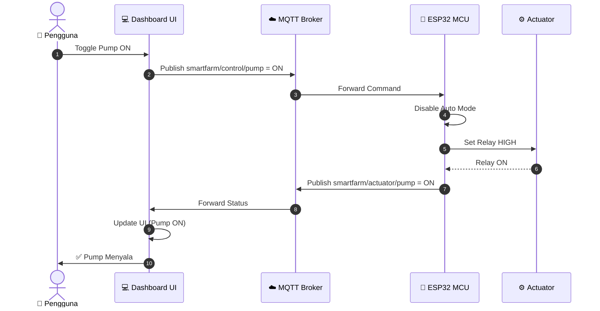
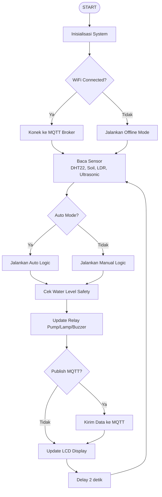
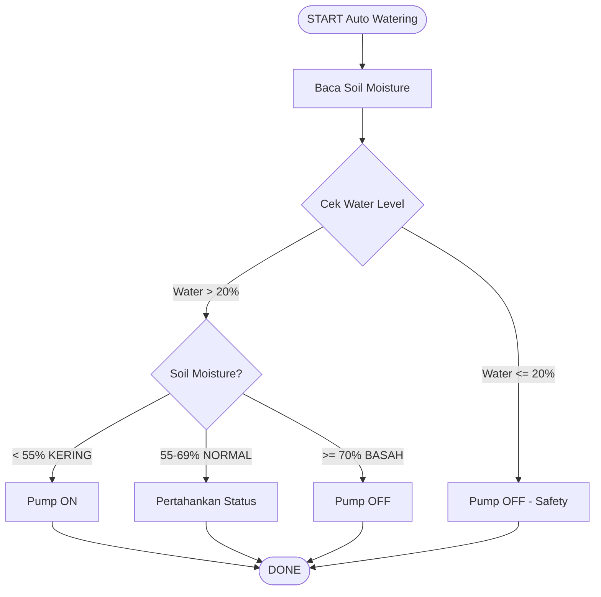
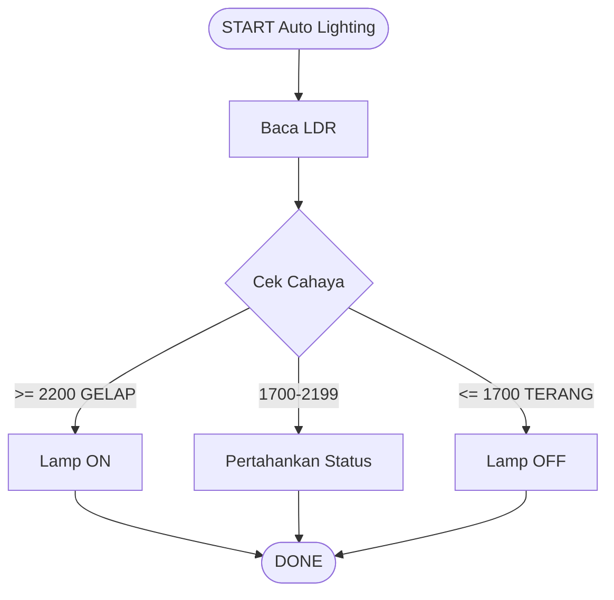
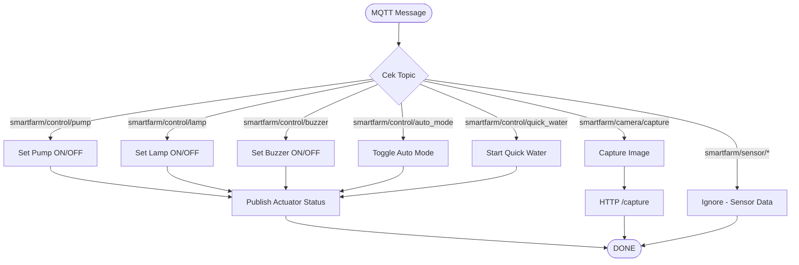

# 🌱 Smart Farming — IoT Plant Monitoring & Automation System

[](https://ficrammanifur.github.io/Smart-Farming/)
[](https://developer.mozilla.org/en-US/docs/Web/HTML)
[](https://developer.mozilla.org/en-US/docs/Web/CSS)
[](https://developer.mozilla.org/en-US/docs/Web/JavaScript)
[](https://www.espressif.com/en/products/socs/esp32)
[](https://www.hivemq.com/)
[](LICENSE)

> Dashboard web modern, clean, dan responsif untuk monitoring dan otomatisasi sistem **Smart Farming IoT**. Dirancang khusus tanpa dependency backend, framework, atau build tool agar dapat langsung dijalankan dan di-host melalui **GitHub Pages**.

**🌐 Live Demo**: [https://ficrammanifur.github.io/Smart-Farming/#dashboard](https://ficrammanifur.github.io/Smart-Farming/#dashboard)

---

## 📌 Daftar Isi

- [Fitur Utama](#-fitur-utama)
- [Struktur Repository](#-struktur-repository)
- [Arsitektur & Diagram Sistem](#-arsitektur--diagram-sistem)
- [Wiring Diagram](#-wiring-diagram)
- [Flowchart Sistem](#-flowchart-sistem)
- [Cara Menjalankan Secara Lokal](#-cara-menjalankan-secara-lokal)
- [Cara Deploy ke GitHub Pages](#-cara-deploy-ke-github-pages)
- [ESP32 Firmware](#-esp32-firmware)
- [Sistem Memory Buffer Camera](#-sistem-memory-buffer-camera-3-photo-queue)
- [MQTT Topics](#-mqtt-topics)
- [Lisensi](#-lisensi)

---

## ✨ Fitur Utama

### 🎨 **Dashboard & UI**
- **Dark Modern Theme**: Antarmuka bertema gelap profesional dengan warna aksen hijau khas Smart Farming.
- **Fully Responsive**: Transisi seamless dari layout *Desktop* (Sidebar + Multi-column), *Tablet*, hingga *Smartphone* (Collapsible Drawer & Single-column cards).
- **Zero-Dependency**: Tidak memerlukan Node.js, npm, React, Vite, Firebase, atau backend server.

### 📊 **Real-time Environment Monitoring**
- 🌡️ **Suhu Environment (°C)** + Indikator tren
- 💧 **Kelembapan Udara (%)**
- 🌱 **Kelembapan Tanah / Soil Moisture (%)** + Progress bar HSL
- 🚰 **Level Tangki Air (%)** + Progress bar HSL
- ☀️ **Status Cahaya (DAY/NIGHT)**

### 📈 **Custom Canvas Trend Graph**
Grafik tren interaktif berbasis HTML5 Canvas murni (bebas dari library eksternal seperti Chart.js).

### ⚙️ **Kontrol & Otomatisasi**
- Monitoring relay **Water Pump**, **Grow Lamp**, **Buzzer**, dan **System MCU**
- Panel kontrol ambang batas otomatis (*Soil Moisture Control & Light Control*)
- **Quick Water**: Siram manual selama 5 detik
- **Mode Auto/Manual**: Toggle otomatisasi global

### 📷 **ESP32-CAM Integration**
- Tombol **Capture Image** dengan MQTT command
- Flash LED otomatis saat capture
- Galeri **3-Photo Buffer** di memory browser (FIFO)
- Modal preview foto resolusi penuh
- **Dual Mode**: HTTP (untuk gambar) + MQTT (untuk command/status)

---

## 📁 Struktur Repository

```text
Smart-Farming/
│
├── 📄 index.html              # Halaman utama dashboard
├── 📄 style.css               # Design system & stylesheet
├── 📄 script.js               # Logic UI, MQTT, chart & camera module
├── 📄 README.md               # Dokumentasi teknis
│
├── 📁 assets/
│   └── 📁 images/             # Asset gambar pendukung
│
├── 📁 firmware/
│   ├── 📁 esp32/
│   │   ├── 📄 IoT.ino         # Full IoT mode + MQTT + WiFiManager
│   │   └── 📄 offline.ino     # Offline automation mode
│   │
│   ├── 📁 esp32cam/
│   │   ├── 📄 final.ino       # ESP32-CAM full integration
│   │   ├── 📄 simpledashboard.ino  # Simple web server test
│   │   └── 📁 test/           # Testing scripts
│   │       ├── CameraWebServer.ino
│   │       ├── app_httpd.cpp
│   │       ├── camera_index.h
│   │       └── camera_pins.h
│   │
│   └── 📁 sensor/
│       ├── 📁 kalibrasi/      # Sensor calibration scripts
│       │   ├── LDR+Lampu.ino
│       │   ├── dht22.ino
│       │   ├── ldr.ino
│       │   ├── soil-moisture.ino
│       │   └── ultrasonik.ino
│       │
│       └── 📁 test/           # Component testing
│           ├── cekrelay.ino
│           ├── gabungan.ino
│           ├── lcd.ino
│           └── led.ino
│
├── 📁 docs/                   # Dokumentasi tambahan
└── 📄 .gitignore
```

---

## 📐 Arsitektur & Diagram Sistem

### 1. Overall System Architecture



---

### 2. Camera Capture Flow



---

### 3. Sensor Data Flow



---

### 4. Control Command Flow (Manual Override)



---

### 5. Input - Process - Output Diagram (IPO)

```mermaid
flowchart LR
    subgraph INPUT["📥 INPUT"]
        A1["DHT22<br>(Suhu & Kelembaban)"]
        A2["Soil Moisture Sensor<br>(Kelembaban Tanah)"]
        A3["LDR<br>(Intensitas Cahaya)"]
        A4["Ultrasonic<br>(Level Air Tandon)"]
        A5["User Command<br>(Dashboard/MQTT)"]
    end

    subgraph PROCESS["⚙️ PROCESS"]
        B1["ESP32 MCU<br>Baca Sensor"]
        B2["Auto Logic<br>(Threshold)"]
        B3["Water Safety<br>(Level Air)"]
        B4["MQTT Publish<br>(Sensor Data)"]
        B5["MQTT Subscribe<br>(Control Command)"]
    end

    subgraph OUTPUT["📤 OUTPUT"]
        C1["LCD Display<br>(Info Real-time)"]
        C2["Relay Pump<br>(ON/OFF)"]
        C3["Relay Lamp<br>(ON/OFF)"]
        C4["Buzzer<br>(Alert)"]
        C5["Dashboard UI<br>(Visualisasi)"]
    end

    INPUT --> PROCESS --> OUTPUT
```



---

## 🔌 Wiring Diagram

### ESP32 DevKit Pinout

```
┌─────────────────────────────────────────────────────────────┐
│                      ESP32 DevKit                          │
│                                                             │
│  ┌───────────┐  ┌───────────┐  ┌───────────┐              │
│  │   3V3     │  │   GND     │  │   EN      │              │
│  ├───────────┤  ├───────────┤  ├───────────┤              │
│  │   VP 36   │  │   VN 39   │  │  34       │ ← LDR       │
│  ├───────────┤  ├───────────┤  ├───────────┤              │
│  │   35      │  │   32      │  │   33      │ ← LED Hijau  │
│  │   ↓ Soil  │  │   TRIG    │  ├───────────┤              │
│  ├───────────┤  ├───────────┤  │   25      │ ← LED Merah  │
│  │   ECHO 19 │  │   18      │  ├───────────┤              │
│  ├───────────┤  ├───────────┤  │   26      │ ← Relay Pump │
│  │   DHT 4   │  │   RX0     │  ├───────────┤              │
│  ├───────────┤  ├───────────┤  │   27      │ ← Relay Lamp │
│  │   TX0     │  │   IO2     │  ├───────────┤              │
│  ├───────────┤  ├───────────┤  │   23      │ ← Buzzer     │
│  │   IO15    │  │   IO13    │  ├───────────┤              │
│  │   ↓       │  │   ↓       │  │   22      │ ← LCD SCL    │
│  │   SCL     │  │   SDA     │  ├───────────┤              │
│  ├───────────┤  ├───────────┤  │   21      │ ← LCD SDA    │
│  │   IO4     │  │   IO0     │  └───────────┘              │
│  │   ↓ DHT   │  │   (Boot)  │                             │
│  └───────────┘  └───────────┘                             │
│                                                             │
└─────────────────────────────────────────────────────────────┘
```

### Wiring Table

| Komponen | Pin ESP32 | Keterangan |
|----------|-----------|------------|
| **DHT22** | GPIO 4 | Sensor Suhu & Kelembaban |
| **Soil Moisture** | GPIO 35 | Sensor Kelembaban Tanah (ADC) |
| **LDR** | GPIO 34 | Sensor Cahaya (ADC) |
| **Ultrasonic TRIG** | GPIO 18 | Trigger Ultrasonic |
| **Ultrasonic ECHO** | GPIO 19 | Echo Ultrasonic |
| **Relay Pump** | GPIO 26 | Kontrol Pompa Air (Active Low) |
| **Relay Lamp** | GPIO 27 | Kontrol Lampu Grow (Active Low) |
| **Buzzer** | GPIO 23 | Alarm/Suara |
| **LED Merah** | GPIO 25 | Indikator Error |
| **LED Hijau** | GPIO 33 | Indikator Normal |
| **LCD I2C SDA** | GPIO 21 | Data LCD |
| **LCD I2C SCL** | GPIO 22 | Clock LCD |
| **Power** | 5V / GND | Power Supply 5V 2A |

---

## 🔄 Flowchart Sistem

### 1. Main System Flow



---

### 2. Auto Watering Flow



---

### 3. Auto Lighting Flow



---

### 4. MQTT Message Handling



---

## 🚀 Cara Menjalankan Secara Lokal

### Opsi A: Langsung Buka File HTML
1. Clone repository:
   ```bash
   git clone https://github.com/ficrammanifur/Smart-Farming.git
   cd Smart-Farming
   ```
2. Buka folder proyek dan klik ganda pada file `index.html` untuk memuatnya di browser.

### Opsi B: Menggunakan Live Server (VS Code)
1. Buka folder proyek di VS Code
2. Klik kanan `index.html` → **Open with Live Server**

### Opsi C: Menggunakan Python
```bash
python -m http.server 8000
```
Akses di browser: `http://localhost:8000`

---

## 🌐 Cara Deploy ke GitHub Pages

1. Push repository ke GitHub:
   ```bash
   git add .
   git commit -m "Initial commit"
   git push origin main
   ```

2. Buka **Settings** repository → **Pages** (di bawah *Code and automation*)

3. Pada **Build and deployment**:
   - **Source**: `Deploy from a branch`
   - **Branch**: `main` → `/ (root)`

4. Klik **Save**

5. Tunggu 1–2 menit, dashboard aktif di:
   ```
   https://ficrammanifur.github.io/Smart-Farming/
   ```

---

## 🔧 ESP32 Firmware

### 📁 `firmware/esp32/IoT.ino` - **Full IoT Mode**
- ✅ WiFiManager (setup WiFi mudah tanpa hardcode)
- ✅ MQTT Integration (HiveMQ Cloud)
- ✅ Auto Watering (berdasarkan soil moisture)
- ✅ Auto Lighting (berdasarkan LDR)
- ✅ Water Level Safety (ultrasonic)
- ✅ Manual Control via MQTT
- ✅ Quick Water (5 detik)
- ✅ Real-time Monitoring
- ✅ LCD Display 16x2 I2C
- ✅ LED Status Indicators
- ✅ Preferences (save water usage)

### 📁 `firmware/esp32/offline.ino` - **Offline Automation Mode**
- ✅ Tanpa WiFi/MQTT
- ✅ Auto Watering (soil moisture threshold)
- ✅ Auto Lighting (LDR threshold)
- ✅ Water Level Safety
- ✅ LCD Display

### 📁 `firmware/esp32cam/final.ino` - **ESP32-CAM Full Integration**
- ✅ WiFiManager (hotspot SmartFarm-CAM)
- ✅ MQTT Command (smartfarm/camera/capture)
- ✅ HTTP Image Server (/capture)
- ✅ Flash LED (ON - nyala saat capture)
- ✅ Dummy Frame (exposure adjustment)
- ✅ Auto Capture setiap 60 detik
- ✅ Status & Response MQTT Topics

---

## 📸 Sistem Memory Buffer Camera (3-Photo Queue)

Sistem tangkapan kamera pada dashboard menggunakan **FIFO Array Buffer**:

1. **Kapasitas Maksimum**: 3 foto
2. **Rotasi Otomatis**: Foto ke-4 otomatis menghapus foto terlama
3. **Zero Performance Impact**: Tidak menggunakan `localStorage` atau `IndexedDB`
4. **Gallery Preview**: Klik foto untuk modal preview

```javascript
function addRecentCapture(captureObj) {
    recentCaptures.unshift(captureObj);
    if (recentCaptures.length > 3) {
        recentCaptures.pop(); // Hapus foto ke-4 (terlama)
    }
    renderRecentCaptures();
}
```

---

## 🔌 MQTT Topics

### Topics yang Digunakan

| Topic | Direction | Description |
|-------|-----------|-------------|
| `smartfarm/sensor/temperature` | ESP32 → Dashboard | Suhu (°C) |
| `smartfarm/sensor/humidity` | ESP32 → Dashboard | Kelembaban (%) |
| `smartfarm/sensor/soil_moisture` | ESP32 → Dashboard | Kelembaban tanah (%) |
| `smartfarm/sensor/water_level` | ESP32 → Dashboard | Level air tandon (%) |
| `smartfarm/sensor/light` | ESP32 → Dashboard | DAY / NIGHT |
| `smartfarm/actuator/pump` | ESP32 → Dashboard | ON / OFF |
| `smartfarm/actuator/lamp` | ESP32 → Dashboard | ON / OFF |
| `smartfarm/actuator/buzzer` | ESP32 → Dashboard | ON / OFF |
| `smartfarm/control/pump` | Dashboard → ESP32 | ON / OFF |
| `smartfarm/control/lamp` | Dashboard → ESP32 | ON / OFF |
| `smartfarm/control/buzzer` | Dashboard → ESP32 | ON / OFF |
| `smartfarm/control/auto_mode` | Dashboard → ESP32 | ON / OFF |
| `smartfarm/control/quick_water` | Dashboard → ESP32 | 5 (detik) |
| `smartfarm/status/esp32` | ESP32 → Dashboard | JSON Status |
| `smartfarm/camera/capture` | Dashboard → ESP32-CAM | CAPTURE |
| `smartfarm/camera/response` | ESP32-CAM → Dashboard | CAPTURING / DONE / ERROR |
| `smartfarm/camera/status` | ESP32-CAM → Dashboard | JSON Status |

### Integrasi MQTT.js

```html
<script src="https://unpkg.com/mqtt@5.0.0/dist/mqtt.min.js"></script>
```

```javascript
const client = mqtt.connect('wss://broker.hivemq.com:8884/mqtt');

client.on('connect', () => {
    console.log('✅ Connected to HiveMQ WSS!');
    client.subscribe('smartfarm/#');
});

client.on('message', (topic, message) => {
    const payload = message.toString();
    handleMQTTMessage(topic, payload);
});
```

---

## 📄 Lisensi

Proyek ini dirilis di bawah lisensi [MIT License](LICENSE). Bebas digunakan untuk keperluan skripsi, tugas akhir, riset engineering, atau proyek IoT personal.

---

## 🙏 Kontribusi

Pull request sangat diterima. Untuk perubahan besar, silakan buka issue terlebih dahulu untuk mendiskusikan apa yang ingin diubah.

1. Fork repository ini
2. Buat branch baru (`git checkout -b feature/AmazingFeature`)
3. Commit perubahan (`git commit -m 'Add some AmazingFeature'`)
4. Push ke branch (`git push origin feature/AmazingFeature`)
5. Buka Pull Request

---

## 📞 Kontak

- **Repository**: [https://github.com/ficrammanifur/Smart-Farming](https://github.com/ficrammanifur/Smart-Farming)
- **Live Demo**: [https://ficrammanifur.github.io/Smart-Farming/](https://ficrammanifur.github.io/Smart-Farming/)
- **Issues**: [https://github.com/ficrammanifur/Smart-Farming/issues](https://github.com/ficrammanifur/Smart-Farming/issues)

---

<div align="center">
  <sub>Built with ❤️ for Smart Farming IoT</sub>
</div>
