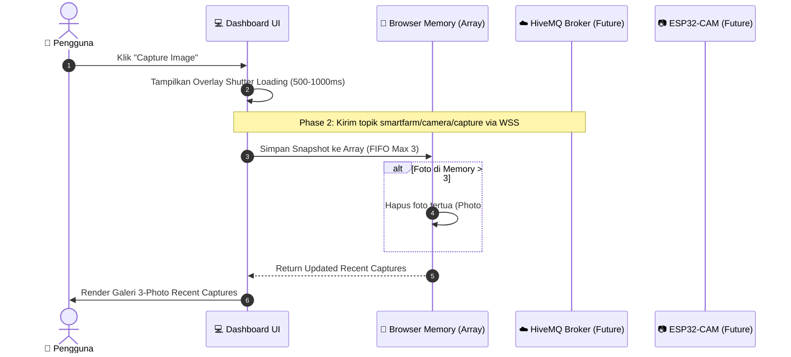

# 🌱 Smart Farming — IoT Plant Monitoring & Automation System

[](https://pages.github.com/)
[](https://developer.mozilla.org/en-US/docs/Web/HTML)
[](https://developer.mozilla.org/en-US/docs/Web/CSS)
[](https://developer.mozilla.org/en-US/docs/Web/JavaScript)
[](https://www.hivemq.com/)
[](LICENSE)

> Dashboard web modern, clean, dan responsif untuk monitoring dan otomatisasi sistem **Smart Farming IoT**. Dirancang khusus tanpa dependency backend, framework, atau build tool agar dapat langsung dijalankan dan di-host melalui **GitHub Pages**.

---

## 📌 Daftar Isi

- [Fitur Utama](#-fitur-utama)
- [Struktur Repository](#-struktur-repository)
- [Arsitektur & Diagram Sistem](#-arsitektur--diagram-sistem)
- [Cara Menjalankan Secara Lokal](#-cara-menjalankan-secara-lokal)
- [Cara Deploy ke GitHub Pages](#-cara-deploy-ke-github-pages)
- [Sistem Memory Buffer Camera (3-Photo Queue)](#-sistem-memory-buffer-camera-3-photo-queue)
- [Rencana Integrasi HiveMQ MQTT WSS](#-rencana-integrasi-hivemq-mqtt-wss)
- [Lisensi](#-lisensi)

---

## ✨ Fitur Utama

- 🎨 **Dark Modern Dashboard Aesthetic**: Antarmuka bertema gelap profesional dengan warna aksen hijau khas Smart Farming.
- 📱 **Fully Responsive**: Transisi seamless dari layout *Desktop* (Sidebar + Multi-column), *Tablet*, hingga *Smartphone* (Collapsible Drawer & Single-column cards).
- 📊 **Real-time Environment Monitoring**:
  - 🌡️ **Suhu Environment (°C)** + Indikator tren
  - 💧 **Kelembapan Udara (%)**
  - 🌱 **Kelembapan Tanah / Soil Moisture (%)** + Progress bar HSL
  - 🚰 **Level Tangki Air (%)** + Progress bar HSL
- 📈 **Custom Canvas Trend Graph**: Grafik tren interaktif berbasis HTML5 Canvas murni (bebas dari library eksternal seperti Chart.js).
- ⚙️ **Status Aktuator & Otomatisasi**:
  - Monitoring relay **Water Pump**, **Grow Lamp**, **Buzzer**, dan **System MCU**.
  - Panel kontrol ambang batas otomatis (*Soil Moisture Control & Light Control*).
- 📷 **Simulasi Kamera ESP32-CAM**:
  - Tombol **Capture Image** dengan simulasi loading shutter delay (500–1000 ms).
  - Generator visualisasi snapshot tanaman realistis berbasis HTML Canvas.
  - Galeri **3-Photo Buffer** di memory browser (FIFO: foto terbawah otomatis terhapus saat foto ke-4 diambil).
  - Modal preview foto resolusi penuh beserta meta-data telemetri saat capture.
- ⚡ **Zero-Dependency Architecture**: Tidak memerlukan Node.js, npm, React, Vite, Firebase, atau backend server.

---

## 📁 Struktur Repository

Repository ini menggunakan struktur langsung di **ROOT** untuk menjamin kompatibilitas 100% dengan GitHub Pages:

```text
smart-farming-iot/
├── index.html         # Halaman utama dashboard (Semantic HTML5)
├── style.css          # Design system & stylesheet (Vanilla CSS3)
├── script.js          # Logic UI, mock state, canvas chart & camera module (ES6+)
├── README.md          # Dokumentasi teknis & panduan deployment
└── assets/
    └── images/        # Folder asset gambar pendukung
```

---

## 📐 Arsitektur & Diagram Sistem

### 1. Overall System Architecture (Future Integration)

```mermaid
flowchart TD
    subgraph Hardware Layer ["🌱 Hardware Layer (ESP32 Nodes)"]
        ESP32["ESP32 Main MCU\n(Sensors: Temp, Humidity, Soil, Water)"]
        ESPCAM["ESP32-CAM Module\n(Camera Capture)"]
        ACTUATORS["Actuators\n(Water Pump, Grow Lamp, Buzzer)"]
    end

    subgraph Cloud Broker ["☁️ MQTT Broker (HiveMQ Cloud)"]
        BROKER["HiveMQ WSS Broker\nport 8884 (WebSocket Secure)"]
    end

    subgraph Frontend Layer ["💻 GitHub Pages Dashboard (Frontend Only)"]
        WSS["WebSocket Client (script.js)"]
        STATE["mockData / State Store"]
        UI["Dashboard UI Components\n(Sensor Cards, Chart, Camera)"]
    end

    ESP32 -->|Publish Telemetry| BROKER
    ESPCAM -->|Publish Image Payload| BROKER
    BROKER -->|Sub: smartfarm/sensors| WSS
    WSS -->|updateSensorData()| STATE
    STATE -->|Render| UI
    UI -->|Pub: smartfarm/camera/capture| BROKER
    BROKER -->|Command| ESPCAM
    ACTUATORS <-->|Relay State| ESP32
```

---

### 2. Camera Capture Data Flow Sequence



---

## 🚀 Cara Menjalankan Secara Lokal

Karena proyek ini 100% *Client-side Vanilla Web Components*, Anda tidak perlu menginstall `npm` atau `Node.js`.

### Opsi A: Langsung Buka File HTML (Paling Mudah)
1. Clone atau unduh repository ini:
   ```bash
   git clone https://github.com/username/smart-farming-iot.git
   ```
2. Buka folder proyek dan klik ganda pada file `index.html` untuk memuatnya di browser pilihan Anda (Chrome, Edge, Firefox, Safari).

### Opsi B: Menggunakan Local HTTP Server (Diuji via VS Code / Python)
- **VS Code**: Klik kanan `index.html` $\rightarrow$ **Open with Live Server**.
- **Python**:
  ```bash
  python -m http.server 8000
  ```
  Akses di browser: `http://localhost:8000`

---

## 🌐 Cara Deploy ke GitHub Pages

Langkah-langkah publikasi dashboard ke internet menggunakan **GitHub Pages**:

1. Push repository Anda ke GitHub.
2. Masuk ke halaman **Settings** repository GitHub Anda.
3. Pada navigasi sebelah kiri, pilih **Pages** (di bawah menu *Code and automation*).
4. Di bagian **Build and deployment**:
   - **Source**: Pilih `Deploy from a branch`.
   - **Branch**: Pilih `main` (atau `master`) dan folder `/ (root)`.
5. Klik **Save**.
6. Tunggu 1–2 menit, dashboard Anda akan langsung aktif di URL:
   `https://<username>.github.io/<repository-name>/`

---

## 📸 Sistem Memory Buffer Camera (3-Photo Queue)

Sistem tangkapan kamera pada dashboard ini dirancang hemat memori tanpa backend server:

1. **FIFO Array Buffer**: Menggunakan variabel JavaScript array (`recentCaptures = []`).
2. **Kapasitas Maksimum**: Berjumlah **3 foto**.
3. **Rotasi Otomatis**: Ketika foto ke-4 ditangkap, foto pertama (paling lama) otomatis dihapus dari memori array (`recentCaptures.pop()`).
4. **Resiko Kinerja 0%**: Tidak membebani `localStorage` atau `IndexedDB`. Jika browser di-refresh, memori kembali bersih.

Contoh Alur Fungsi pada `script.js`:
```javascript
function addRecentCapture(captureObj) {
    recentCaptures.unshift(captureObj); // Tambah foto baru ke urutan pertama
    if (recentCaptures.length > 3) {
        recentCaptures.pop();           // Buang foto ke-4 (terlama)
    }
    renderRecentCaptures();
}
```

---

## 🔌 Rencana Integrasi HiveMQ MQTT WSS (Tahap Selanjutnya)

Pada tahap frontend ini, semua UI terhubung ke objek terisolasi `mockData`. Kode telah dirancang modular sehingga integrasi MQTT di masa mendatang dapat dilakukan **tanpa mengganggu atau merombak struktur UI**.

### 1. Struktur Objek Mock State (`script.js`)
```javascript
const mockData = {
    temperature: 28.4,
    humidity: 72,
    soilMoisture: 43,
    waterLevel: 78,
    light: "DAY",
    pump: false,
    lamp: true,
    buzzer: false,
    system: "ONLINE"
};
```

### 2. Modul Handler Siap MQTT
Fungsi-fungsi berikut telah disiapkan untuk dipanggil langsung oleh MQTT message listener:

```javascript
// Dipanggil saat pesan diterima di topik: smartfarm/sensors
updateSensorData(data);

// Dipanggil saat pesan diterima di topik: smartfarm/actuators
updateActuatorStatus(data);

// Dipanggil saat pesan status LWT (Last Will & Testament): smartfarm/status
updateSystemStatus(status);

// Dipanggil saat trigger perintah capture kamera: smartfarm/camera/capture
handleCameraCommand();
```

### 3. Langkah Integrasi HiveMQ Cloud WSS (Next Phase)
Tambahkan MQTT.js CDN pada `index.html`:
```html
<script src="https://unpkg.com/mqtt/dist/mqtt.min.js"></script>
```

Inisialisasi koneksi HiveMQ Secure WebSockets:
```javascript
const client = mqtt.connect('wss://broker.hivemq.com:8884/mqtt');

client.on('connect', () => {
    console.log('Connected to HiveMQ WSS!');
    client.subscribe('smartfarm/#');
});

client.on('message', (topic, message) => {
    const payload = JSON.parse(message.toString());
    if (topic === 'smartfarm/sensors') updateSensorData(payload);
    if (topic === 'smartfarm/actuators') updateActuatorStatus(payload);
});
```

---

## 📄 Lisensi

Proyek ini dirilis di bawah lisensi [MIT License](LICENSE). Bebas digunakan untuk keperluan skripsi, tugas akhir, riset engineering, atau proyek IoT personal.
